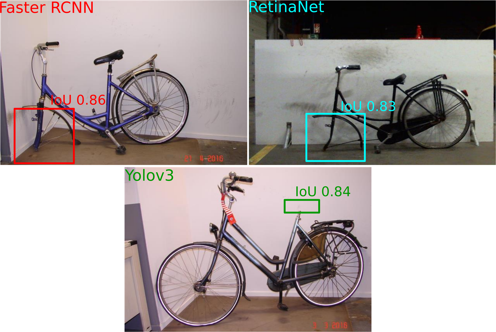
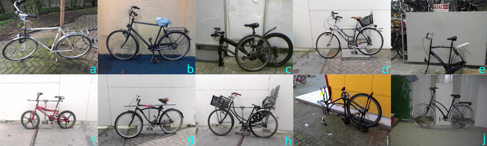

# HALLUCINATION IN OBJECT DETECTION — A STUDY IN VISUAL PART VERIFICATION

In [ICIP, 2021](https://arxiv.org/abs/2106.02523).
[Osman Semih Kayhan](https://oskyhn.github.io/), [Bart Vredebregt](https://www.aiir.nl/team) and [Jan van Gemert](http://jvgemert.github.io/index.html). 

This repository contains the DelftBikes dataset and the experiments of the [paper](https://arxiv.org/abs/2106.02523). The dataset and the experiments will be available soon.  

## Abstract

We show that object detectors can hallucinate and detect missing objects; potentially even accurately localized at their expected, but non-existing, position. This is particularly problematic for applications that rely on visual part verification: detecting if an object part is present or absent. We show how popular object detectors hallucinate objects in a visual part verification  task  and  introduce  the  first  visual  part  verification dataset: DelftBikes, which has 10,000 bike photographs, with 22 densely annotated parts per image, where some parts may be missing. We explicitly annotated an extra object state label for each part to reflect if a part is missing or intact.  We propose to evaluate visual part verification by relying on recall and compare popular object detectors on DelftBikes.

## 1. How do the common object detectors hallucinate the objects?

The figure below shows some hallucination examples on  DelftBikes for FasterRCNN, RetinaNet and YOLOv3. Faster RCNN and RetinaNet detect the front wheel and YOLOv3 predicts the saddle with a high IoU score. Deep object detectors may detect non-existent objects at their expected locations.

## 2. Some images from DelftBikes dataset

DelftBikes has 10,000 bike images annotated with bounding box locations of 22 different parts where each part is in one of four possible states: *intact*, *damaged*, *absent* and *occluded*. The similar pose, orientation and position can be misleading for context-sensitive detectors as often one or two parts are missing (the saddle in (a), the wheels in (e) etc.).

## Citation

Please cite this project as follows:

@article{kayhan2021hallucination, 
    title={Hallucination in Object Detection - A Study in Visual Part Verification}, 
    author={Osman Semih Kayhan and Bart Vredebregt and Jan C. van Gemert}, 
    year={2021}, 
    eprint={2106.02523}, 
    archivePrefix={arXiv}, 
    primaryClass={cs.CV} 
}

